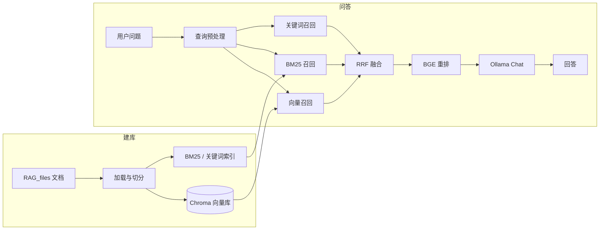

# 本地 RAG 知识库系统

基于 **LangChain + Ollama + Chroma** 的检索增强生成（RAG）系统，支持在私有文档上问答。项目提供两种使用形态：

| 形态 | 入口 | 适用场景 |
|------|------|----------|
| **命令行版** | 仓库根目录 `rag_system_code.py` | 本地开发、批量评估、脚本化文档管理 |
| **Web / API 版** | `rag_system/`（FastAPI + 登录 UI + Docker） | 团队内网部署、浏览器问答、REST 集成 |

默认知识库示例文档位于 `rag_system/RAG_files/`，可按需替换或追加。

---

## 功能概览

- **文档加载**：`.txt`、`.pdf`、`.docx`、`.doc`（Word 会按标题转为 Markdown 结构后再切分）
- **向量库**：Chroma 持久化；首次运行自动建库，后续增量同步（哈希 + 清单 `document_manifest.json`）
- **混合检索**：向量检索 + BM25 + 可选关键词倒排，**RRF 融合** 后由 **BGE CrossEncoder** 重排（可 `--fast` 关闭重排）
- **生成**：Ollama 本地大模型，Prompt 约束「仅依据参考资料回答」
- **文档管理**：增删改、目录同步、文件监控（`--watch`）
- **评估**：CSV 测试集 + `RAGEvaluator`（检索/生成指标与 Judge），结果写入 `eval_results/`
- **Web 版 extras**：JWT 登录、文档上传、流式问答（SSE）、健康检查

---

## 系统架构



---

## 目录结构

```
RAG_code/
├── rag_system_code.py      # CLI 主程序（与 rag_system/app/rag_system.py 同源逻辑）
├── models/
│   └── bge-reranker-base/  # 本地重排模型（sentence-transformers CrossEncoder）
├── rag_testsets.csv        # 默认评估测试集（可选）
├── eval_results/           # 评估输出（运行 --eval 后生成）
└── rag_system/
    ├── app/
    │   ├── rag_system.py   # RAG 核心（LocalRAGSystem、RAGEvaluator）
    │   ├── api.py          # FastAPI 服务
    │   ├── auth.py         # JWT + bcrypt
    │   ├── static/         # 前端静态资源
    │   └── templates/      # 登录 / 问答页
    ├── RAG_files/          # 默认文档目录（Docker 内挂载为 /app/RAG_files）
    ├── requirements.txt
    ├── Dockerfile
    ├── docker-compose.yml
    └── scripts/start.sh    # 检查 Ollama 模型并 docker compose 启动
```

---

## 环境要求

### 通用

- **Python** 3.10+（Docker 镜像使用 3.10）
- **[Ollama](https://ollama.com/)** 本地服务（默认 `http://localhost:11434`）
- 推荐拉取的模型（与默认配置一致）：
  - 对话：`qwen2.5:7b`
  - 嵌入：`nomic-embed-text-v2-moe`
- **重排模型**：将 `bge-reranker-base` 放在仓库 `models/bge-reranker-base/`（或设置 `RERANK_MODEL` 环境变量）

### CLI 额外依赖

在仓库根目录安装（可参考 `rag_system/requirements.txt`，与 Web 版一致）：

```bash
pip install -r rag_system/requirements.txt
```

---

## 快速开始（命令行）

### 1. 准备文档与模型

- 将 PDF/Word/TXT 放入文档目录（见下方「路径说明」）
- 确认 Ollama 已启动且已 `ollama pull` 上述两个模型
- 确认 `models/bge-reranker-base/` 存在

### 2. 首次建库并交互问答

在**仓库根目录**运行（建议先按需修改 `rag_system_code.py` 顶部 `DOCS_DIR`、`CHROMA_DB_DIR`，见路径说明）：

```bash
python rag_system_code.py
```

首次运行会构建向量库；之后自动加载已有库。终端内直接输入问题，输入 `quit` 退出。

### 3. 常用 CLI 参数

```bash
# 单次问答
python rag_system_code.py --ask "什么是 CABAC？"

# 快速模式（跳过重排，延迟更低）
python rag_system_code.py --fast --ask "你的问题"

# 跳过预热（首次问答会较慢）
python rag_system_code.py --no-warmup

# 查看知识库状态
python rag_system_code.py --status

# 文档管理
python rag_system_code.py --add path/to/doc.pdf
python rag_system_code.py --remove path/to/doc.pdf
python rag_system_code.py --sync
python rag_system_code.py --watch --watch-interval 5

# 批量评估
python rag_system_code.py --eval --testset rag_testsets.csv --limit 10
```

完整参数说明：

```bash
python rag_system_code.py -h
```

### 路径说明（CLI）

`rag_system_code.py` 中默认配置为：

- `DOCS_DIR = '../RAG_files'`
- `CHROMA_DB_DIR = '../chroma_db'`
- `RERANK_MODEL = './models/bge-reranker-base'`

在仓库根目录执行时，`../RAG_files` 指向**上级目录**，通常应改为例如：

```python
DOCS_DIR = './rag_system/RAG_files'
CHROMA_DB_DIR = './chroma_db'
```

Web 版通过环境变量覆盖路径，无需改代码。

---

## 快速开始（Web / Docker）

### 1. 准备

- 本机已安装 **Docker** 与 **docker compose**
- 本机 **Ollama** 运行在 `11434` 端口
- 构建镜像前，将重排模型复制到 Docker 构建上下文（`docker-compose` 的 `context` 为 `rag_system/`）：

```bash
# 在 rag_system 下建立 models 并复制重排模型（示例）
mkdir -p rag_system/models
xcopy /E /I models\bge-reranker-base rag_system\models\bge-reranker-base
```

> `docker-compose.yml` 中 `RERANK_MODEL=/app/models/bge_reranker_base`，请保证容器内路径与拷贝目录名一致，或在 compose 里改为 `/app/models/bge-reranker-base`。

### 2. 启动

**Linux / macOS**（在 `rag_system/` 下）：

```bash
chmod +x scripts/start.sh
./scripts/start.sh
```

**Windows** 可手动：

```bash
cd rag_system
docker compose build
docker compose up -d
```

### 3. 访问

| 地址 | 说明 |
|------|------|
| http://localhost:8000/login | 登录页 |
| http://localhost:8000/app | 问答界面（需登录） |
| http://localhost:8000/docs | OpenAPI / Swagger |
| http://localhost:8000/api/health | 健康检查 |

默认管理员（**生产环境务必修改**）见 `docker-compose.yml`：

- 用户：`ADMIN_USER`（默认 `admin`）
- 密码：`ADMIN_PASSWORD`（默认 `admin123`）
- JWT：`JWT_SECRET_KEY`

Ollama 在容器外时，compose 使用 `OLLAMA_BASE_URL=http://host.docker.internal:11434`（Windows / Docker Desktop 一般可用）。

### 4. 本地直接跑 API（不用 Docker）

```bash
cd rag_system/app
set DOCS_DIR=../RAG_files
set CHROMA_DB_DIR=../chroma_db
set RERANK_MODEL=../../models/bge-reranker-base
set OLLAMA_BASE_URL=http://localhost:11434
uvicorn api:app --host 0.0.0.0 --port 8000
```

（Linux/macOS 将 `set` 换为 `export`。）

---

## 主要 API（Web 版）

需登录后携带 Cookie `access_token` 或 `Authorization: Bearer <token>`。

| 方法 | 路径 | 说明 |
|------|------|------|
| POST | `/api/auth/login` | 登录 |
| POST | `/api/ask` | 问答（返回耗时与引用片段） |
| POST | `/api/ask/stream` | SSE 流式问答 |
| GET | `/api/documents/status` | 索引状态 |
| POST | `/api/documents/upload` | 上传并后台索引 |
| DELETE | `/api/documents/{filename}` | 删除文档 |
| POST | `/api/documents/sync` | 同步目录与向量库 |
| POST | `/api/evaluate` | 后台跑评估任务 |

---

## 配置项摘要

核心常量位于 `rag_system_code.py` / `rag_system/app/rag_system.py` 文件头部，Web 版优先读取环境变量：

| 变量 / 常量 | 含义 | 默认值 |
|-------------|------|--------|
| `OLLAMA_BASE_URL` | Ollama 地址 | `http://localhost:11434` |
| `EMBED_MODEL` | 嵌入模型 | `nomic-embed-text-v2-moe` |
| `CHAT_MODEL` | 对话模型 | `qwen2.5:7b` |
| `DOCS_DIR` | 原始文档目录 | `../RAG_files` |
| `CHROMA_DB_DIR` | 向量库目录 | `../chroma_db` |
| `RERANK_MODEL` | CrossEncoder 路径 | `./models/bge-reranker-base` |
| `CHUNK_SIZE` / `CHUNK_OVERLAP` | 切分大小 / 重叠 | 500 / 50 |
| `TOP_K` / `RERANK_TOP_N` | 召回数 / 送入 LLM 片段数 | 10 / 5 |
| `ENABLE_RERANK` / `FAST_MODE` | 是否重排 / 快速模式 | True / False |
| `SIMILARITY_THRESHOLD` | 相似度过低则视为无资料 | 0.3 |

可选增强（默认多为关闭）：关键词增强、多 Query、LLM 文档压缩等，见源码注释 `[OPT-xx]`。

---

## 评估测试集格式

CSV 至少包含列：

- `question`：问题
- `ground_truth`：参考答案

可选列：`question_type`、`difficulty`。运行 `--eval` 或调用 `/api/evaluate` 后，明细与汇总写入 `eval_results/`。

---

## 常见问题

1. **首次问答很慢**  
   Ollama 冷启动 + 重排模型加载。使用默认 `PRELOAD_MODELS=True`，或 CLI 不要加 `--no-warmup`；Web 启动时会 `warmup_models`。

2. **向量库为空**  
   确认 `DOCS_DIR` 下有支持的文件，执行 `python rag_system_code.py` 或 Web 启动时的自动 `build_or_load_db()`，或用 `--sync` / `/api/documents/sync`。

3. **Docker 连不上 Ollama**  
   检查 `OLLAMA_BASE_URL`、`extra_hosts: host.docker.internal`，以及防火墙与 Ollama 是否监听 `0.0.0.0`。

4. **重排报错或路径找不到**  
   确认 `models/bge-reranker-base` 完整，且 Docker 构建时已 COPY 到镜像；或临时 `--fast` / 设置 `ENABLE_RERANK=False`。

